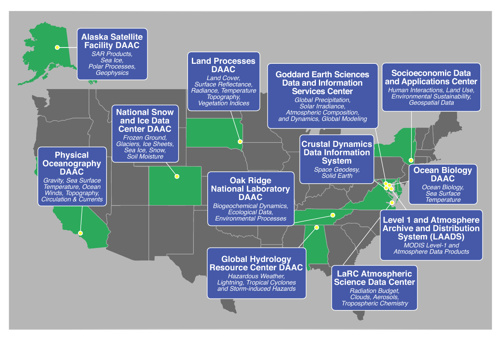

# Why Use the Cloud? An Earthdata Vision

## Introduction

Large remote sensing missions archived by the EOSDIS (Earth Observing System Data and Information System) DAACs (Distributed Active Archive Center) are challenging the traditional download and access paradigm of the end user. While the core functionality of the DAACs (Ingest and Archive, cataloging, and data access) will always be available, EOSDIS is also exploring new ways to enable science and the transformation of data into knowledge and information. The cloud offers a scalable and effective way to address storage, network, and data movement concerns while offering a tremendous amount of flexibility to the user. The new big missions, SWOT and NISAR, will push EOSDIS into its next phase -- co-located, multidisciplinary, cloud based archive and distribution centers that enable analysis next to the data.

## New Missions, Big Data

Big Data is the largest reason, pun intended, for the move to the cloud. Upcoming missions, such as SWOT and NISAR shift the scales of data archived at the DAAC. The SWOT mission will produce over 60 PB of data over the life of the 3 year mission, while NISAR will generate <<150 PB>> of data. These are orders of magnitude larger than anything users have seen in the remote sensing world, and represent a challenge for the DAACs, EOSDIS, and the end user community. Let’s not forget extended missions, often the norm, need to be addressed. If valuable science products are coming down the pipeline, a lack of resources on the DAAC side should not be the reason a mission does not continue onward.

Aside from these massive missions, we are seeing near term missions such as new additions to the Sentinel series breach the 1 PB mark. Storage, network and data movement capabilities are easily taken for granted until the size of the data becomes unwieldy.

### Storage

From the DAACs perspective, the amount of infrastructure to store this data is exceptional. Not only do we need to store the data for the life of the mission, but in perpetuity as well. Add to that redundancy (multiple copies of the data in case of disk failures) and disaster recovery (the ability to restore an entire archive should something catastrophic happen), and we’re looking at storing multiple copies of multi-petabyte data! All of this would require racks and racks of servers for data storage. Servers need to be maintained and replenished on regular schedules, and doing this at the scales of Big Data often require teams of engineers to support them. This support gets away from the core purpose of the DAACS; to archive and provide access to science data products.

By moving to the cloud we treat storage as a commodity; if more storage is required, DAACs can quickly provision and pay for more, if less storage is needed, we remove data and pay for less. The DAACs have greater flexibility to move data to cheaper (colder) storage options when it has become less useful (e.g. newer versions have become available), while preserving the ability to access the data should the need arise.

### Network

Much like storage, network capacity is a critical component for the Earthdata enterprise, not only for the distribution of data to the end users, but for the ingest of the science products in the first place. To ingest multiple terabytes of data per day, DAACs need to access that data and pull it from the providers location (or have the provider push the data). While a single large mission might be feasible in an on-premise network, what happens when another big mission comes in? Can we easily double the amount of network capacity we have if a second mission needs massive amounts of data throughput?

In fact, there doesn’t even need to be a second mission. A reprocessing campaign (when older data is re-processed through newer versions of code, algorithms, and ancillary products with greater accuracy or improvements) by the mission itself can be run at orders of magnitude higher than the forward processing rate. To ensure the capacity to handle this in an on-premise solution, DAACs would need to procure (and pay for) the maximum bandwidth volume they expect; but would only use all of this bandwidth during those specific times of reprocessing. This is
often only once a year.

The cloud offers the ability to scale our network with demand. For the NISAR and SWOT missions, the data products will be produced within the same cloud the DAACs are running in, and therefore will have access and network bandwidth at the fastest possible speeds offered by the cloud  provider (in this case Amazon Web Services, AWS).

### Data Movement and Processing

Even if the DAACs stored all of this data on-premise and had the network capacity to acquire and deliver it to end users, we are still not confident that access to the data would be equitable. To be sure, the DAACs will not charge end users for access to data - this is not what is meant by equitable. Here, equitable means access to the data should not require a massive capital investment in infrastructure to enable science. For instance, well funded corporations or government entities (foreign and domestic) can acquire the resources to pay for the storage and compute power to process multi-petabyte data. But what about curious science users? What about a researcher or decision maker in an area of the world lacking high bandwidth internet access? Or a graduate student working on a thesis? Or a startup looking to prove its mettle with limited funding?

There are different solutions to this problem, but combined with the storage and network limitations discussed above, EOSDIS has chosen a cloud solution to best enable end user science. While the cloud may not be ideal for everyone (indeed there are economic and technological situations where users may not want to use the cloud at all, and we will address them later), it does offer solutions to a problem that these large missions and need for heterogeneous, or multi-source, data present.

The users in the instances above can address several of their issues with the cloud. By moving their processing to the cloud:

1. The user with limited bandwidth can find, access, and process all of the data required without need to download data to their local computers. Only resulting data products or the final calculations and summaries need to be downloaded, and may be optional as well. This represents the download of information or knowledge as opposed to the download of data.

2. Users without the resources to download and store data can use the cloud to do their processing without having to pay upfront for storage or compute hardware. Compute can be spun up and down to minimize cost.

3. Users who can afford the upfront costs may still opt to use the cloud if data is not needed in perpetuity, or massive amount of computational power is required for a small amount of time. This is similar to the economic model of reserving time on a high performance computing (HPC) platform, though architecturally there are major differences.

To address data movement issues, the DAACs will provide services to minimize the amount of data moved by the users. These services will be responsible for data transformations required for the scientific analysis of data. This addresses the 80% from the “80% issue”[1] whereby 80% of research or data analysis is spent acquiring and cleaning it for a specific use. To provide these services, the DAACs themselves will leverage the compute power offered by the cloud - as demand for a service or dataset spikes (e.g. a flood event or hurricane) more services can be deployed to handle the demands of the user. While this is something smart architectures from the DAACs have accommodated, the Big Data issue presents a number of unknowns with regards to the number of users requiring these services, and cloud-based computing would likely alleviate some of those new challenges. In addition, new communities and user patterns coming to the cloud and Big Earthdata also have to be considered.

## Increase Science Impact

As shown above, there are a multitude of technical reasons for moving to the cloud. Non-technical reasons focus mainly on increasing the science value of DAAC holdings by utilizing cloud computing.

### Multidisciplinary Data Access

Currently the DAACs housing NASA data are spread across the country (see Figure 1 below). While the data can be stored in isolation, end users require multiple data products to inform their research and decision making. Different DAACs use different interfaces and access mechanisms, requiring users to understand the nuances of each DAAC in order to retrieve data for their use. This is another example of work going into the 80% issue. While this in the past was simply a hassle, with the advent of multi-petabyte data, this becomes a substantial roadblock.

**Figure 1** NASA's EOSDIS Distributed Active Archive Centers (DAACs)

For instance, if the Alaska Satellite Facility (ASF) DAAC - the DAAC hosting NISAR data - and the Physical Oceanography DAAC (PO.DAAC) - the DAAC hosting SWOT data - house their data on-premises in Fairbanks, AK and Pasadena, CA respectively, how do users access both massive datasets to do their analysis? EOSDIS, again, is using the cloud to solve some of these issues- by storing both datasets in the same cloud region (a named set of AWS resources in the same geographical area[2]). Users wanting to access one or both of these science products will have, essentially, unlimited compute resources - or as much as can be afforded - at their fingertips.

While not all of the EOSDIS datasets are currently in the cloud, future missions - specifically larger ones - might also be located in the cloud. There is also a process for moving synergistic datasets from on-premise DAACs to the cloud, so that users can take advantage of the storage, network, and compute available in this environment.

### End User Capabilities and Access

Another issue directly impacting multidisciplinary data access are the services and interfaces available to the end user. Previously, DAACs built their own tooling and access methods which worked well on a DAAC-by-DAAC basis, but led to complication and frustration from the user community when accessing multiple archives. While the cloud doesn’t fix this problem, it allows EOSDIS to focus on consistent interfaces, access mechanisms, and software reuse to better prevent this problem moving forward.

The EOSDIS focus on reusability and common software also means the DAACs can concentrate on building services and tools to better enable the end user science communities. This means transformations of raw data into user preferred formats, matching target datasets' grid and resolution, and some high level analysis that can be run on a given geographic region.

While transformations and services are important on the archived data itself, the cloud also gives the opportunity to explore more analysis-ready data (ARD) formats. Imagine having the power to define a complex set of criteria (quality flag, land mask, etc) and then perform rudimentary to complex calculations on that filtered data. Now imagine all that happening in real time- an interactive science browsing system. These are the next generation services the DAACs can offer, while maintaining the rich metadata, citation, and collection information you’ve grown accustomed to.

## Issues and Concerns

While EOSDIS and the DAACs are excited about the cloud based future, they are also very much aware there are a number of issues that may impact users and their adoption of the cloud. This section calls a few of these out by name as well as acceptance and mitigation standards used to address the core issue.

### Education and skill sets required in the cloud

Proponents of moving to the cloud often cite the simplicity of cloud solutions. The sell of focusing on your domain while letting AWS or Google do the heavy lifting sounds enticing, but is far from the truth. In order to leverage cloud functionality (scalability, elasticity, infinite storage) most applications and scripts will need to leverage new services and APIs. For instance, to get
a durable (i.e. file loss resistant/tolerant) data store, one needs to move away from “file based” systems and migrate to something like Simple Storage Service (S3), which is an “object storage” system. If your processing is heavily file dependent (I/O), there may be some growing pains with moving files around and vice versa. Another is the costing. Many users cite economic understanding and costing of the cloud as a barrier to usage. Is there a good way of understanding and forecasting cloud budgets? And how does this change the more and more you utilize cloud services offered?

### Economic situations to not use the cloud

There are some situations where moving to the cloud is not the ideal situation. Processes that need to store and egress (e.g. download from the cloud to a non-cloud machine) a lot of information for a long period of time may not be the right fit. The irony of a collection of DAACs giving this advice is not lost on us. The cost models of storing data usually become more expensive over time than purchasing your own hardware for storage. Networking and compute may behave differently depending on the usage patterns of your hardware. 

Hardware such as a processing server that is consistently and constantly being used (e.g. CPU or memory usage greater than 80%) may be better suited for purchase and running locally since the cost of running this instance in the cloud gets expensive and you lose the tradeoffs of scalability and elasticity (you lose these because your processing level is consistent- it’s not fluctuating up and down drastically so being able to add or remove CPU does not help you).

### Access to the cloud

Finally, there are some groups that may not have access to cloud computing resources. Some educational institutions may direct users to local computing facilities, while other government agencies may not have the infrastructure and accounting in place to allow access in the near term. Finally, partner organizations overseas have shown reluctance and hesitation to use the cloud for different reasons. No matter the reason, EOSDIS and the DAACs will continue to serve end users on all platforms, including the cloud, supercomputers, and on premise solutions.

---

[1] https://www.ibm.com/cloud/blog/ibm-data-catalog-data-scientists-productivity

[2] https://docs.aws.amazon.com/general/latest/gr/glos-chap.html
