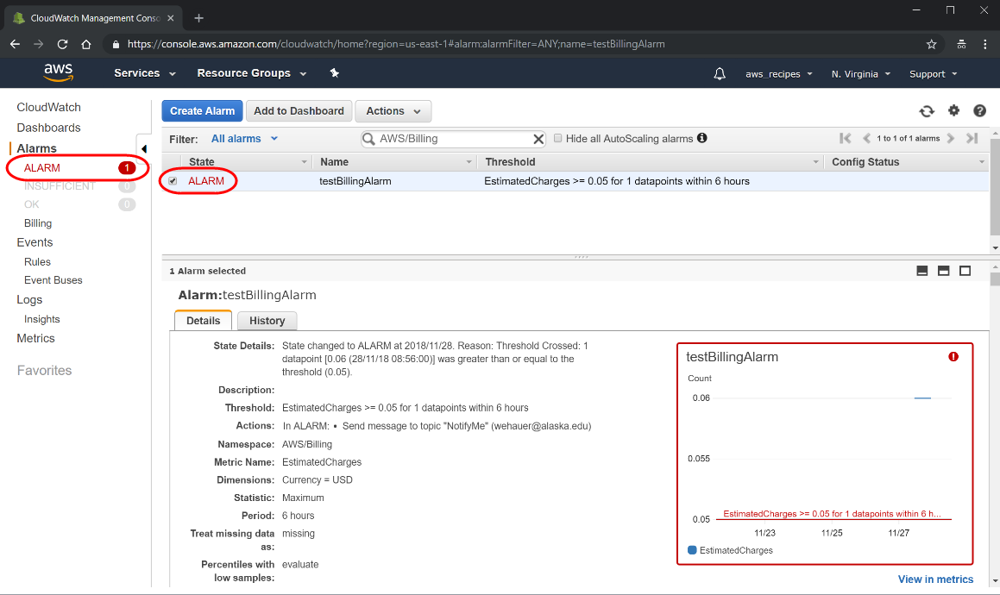

# Safeguard your Amazon Web Service (AWS) account

NASA's Earth Observing System Data and Information System (EOSDIS) is evolving to implement a commercial cloud-based solution to ingest, archive, process, distribute, and manage the anticipated large volumes of new mission data. Placing the EOSDIS archive collectively in the cloud will, for the first time, place NASA Earth Observing (EO) data “close to compute” and improve management and accessibility of these data while also expediting science discovery for data users.  

Having EOSDIS data in the cloud will not change the existing user experience of interacting with these data, but it will offer new methods of access not otherwise possible with on-premises platforms. See the [Why Use the Cloud - A Getting Started Guide](01-Why_Use_the_Cloud__An_Earthdata_Vision.md) tutorial for more background on NASA’s evolution and efforts to a cloud-based Big Data solutions.  

Under NASA’s full and open data policy, all NASA mission data (along with the algorithms, metadata, and documentation associated with these data) **must be freely available and provided to the public as soon as possible** following a checkout period to ensure data accuracy and validity. **All NASA data will continue to be free to access and download, regardless of whether the user is working in the cloud or not**.  

NASA’s Office of the Chief Information Officer has chosen AWS as the source of general-purpose cloud services for NASA, including ingest, archive, processing, distribution, and management of data. In addition, NASA EOSDIS is working with Google Earth Engine (GEE) to make NASA data accessible in the GEE cloud-based analysis platform.  

The AWS cloud platform uses Elastic Compute Cloud (EC2) instances, which are virtual computers that a user creates to perform processing operations in place of using a desktop or laptop computer or other on-premises computing hardware. They are customizable based on user computing needs and consist of the user’s choice of operating system, type of CPU, amount of memory and storage; and the security settings that determine how the instance can be accessed. Some of these customizations (e.g., CPU, memory, storage) can impact user's cost of using the cloud.  

This introductory tutorial for understanding and estimating cost in the cloud:  

-   provides an overview of the cost model for NASA EOSDIS - cloud data access and use  
-   highlights several relevant user scenarios using the AWS Pricing Calculator to provide guiding examples and consideration for EOS data users in the cloud, and  
-   summarizes AWS and other cloud platforms resources for budgeting cost in the cloud.  

## Cost in the cloud

### Cost model

Figure 1 shows a general high-level user workflow diagram, giving a sense for the data management and cost model for discovering, accessing and using NASA EOSDIS data in the cloud. **All NASA data is free to access and download, regardless of whether the user is working in the cloud**.  

  
**Figure 2.1.** General high-level user workflow diagram, giving a sense for the data management and cost model of discovering, accessing and using NASA EOSDIS data in the cloud.  

A user will be able to employ cloud-based EOSDIS-provided services to discover, search, access, and download data, at no cost to the user. The user has the option to:  

-   download the data to their own local machine, server, or HPC account - free of charge  
-   connect to it from their (AWS) cloud instance - free of charge, or  
-   move the data out of the AWS-hosted cloud (free of charge) and move it to another cloud platform of choice.  

If a user wants to store data in their own (AWS) cloud instance or cloud storage, the user is responsible for that storage cost.  

### User Scenarios

The following scenarios provide select examples of representative but varying Earth science user workflows. It can be a quick reference guide for the user to get a sense of how storage amount, compute power, memory, frequency of use, pricing strategy, etc. might affect total cost*.  

#### User Scenarios descriptions

-   **Climate Researcher** (large data volume): This user has large data volume (e.g., over 20 years of global ocean data) and needs to complete an analysis in 3 years, due to the length of the proposal award. Due to the data volume, storage cached memory will not suffice and cloud storage will be needed. Since the researcher has 3 years to complete the analysis, "spot market" may be a way to reduce cost as the analysis will be queued and processed when the processing cost is lower (note: the table does not reflect spot market).  
-   **Operational User** (quick results): This user runs a forecasting model; latency needs to be short, for warnings and natural disaster mitigation to be provided in a timely manner. The fastest way to accomplish this is to run the model in the same region the data are located, but that might not be possible if the necessary data products reside in multiple locations (NASA vs. NOAA vs. USGS). The user will use on-demand processing, as there is no wait to process the data, but it is more expensive.  
-   **Synoptic-scale Researcher** (fluctuations): The synoptic researcher studies regional phenomenon from satellites and in situ.  The data volume fluctuates as data from in situ comes in batches. The user needs flexible storage and processing. A good choice for this user is "spot market", as mentioned above in the climate researcher example.  
-   **Field Experimenter** (no local resources): When out conducting a field experiment, this user needs know where the next location should be based on weather and/or ocean conditions. When out in the field, either on a research vessel or in a remote area, the only internet access is either from cell towers or communications. Downloading data is not an option due to the low bandwidth. The best option is to run scripts that can visualize and analyze satellite data in the cloud so all the user needs to is an image and a table of values. The processing needs to be done on demand so results are timely, but there does not need to be a lot of storage; most of this can be kept in the cache.  

Using the AWS pricing model (AWS published rates at a given time), the resources used and the cost to each user is summarized in Table 2.1. AWS storage and storage types are further discussed in the later section.

**NOTE:** Table 2.1 should be used as a general guide only. Many factors, including workflow and user-specific needs as well as AWS costing, can influence and vary the ultimate cost to a user.

**Table 2.1.**  User scenarios* and associated cost** in using EC2 Instances (e.g., for processing data), and S3 and local (instance-attached) Elastic Block Storage (EBS) storage.  

|User             |Climatology Researcher |Operational User |Synoptic-Scale Researcher |Field Researcher |Notes |
|-----------------|-----------------------|-----------------|--------------------------|-----------------|------|
|**Compute**      |                       |                 |                          |                 |      |
|Computer Power  |2 vCPU  |2 vCPU  |1 vCPU  |2 vCPU  |AWS correlates higher vCPU with more memory  |
|Memory  |64 GiB  |32 GiB  |32 GiB  |8 GiB  |AWS correlates higher vCPU with more memory  |
|User Frequency1|*Monthly Spikes \| 25%* |*Constant Use \| 100%* |*Weekly Spikes \| 25%* |*Daily Spikes \| 25%* |Workload \| Duty cycle
|Project Length|3 Years|On Going|3 Years|3 Weeks|
|AWS Pricing model Instance Type2  |On-demand, m5.4xlarge (0.77/hr) \| $141  |Std RI, m5.2xlarge, 1-yr, $0 up front \| $180  |On-demand, m5.2xlarge (0.39/hr) \| $71  |On-demand, m5.large (0.1/hr) \| $185  |Can be reduced if processing can fit within Lambda model  |
|Local Storage3 (EBS: general purpose SSD)|2TB \| $205|500GB \| $50|1TB \| $102|150GB \| $15|Can be reduced if contents moved to S3 during downtime|
|S3 Storage4|2TB \| $47  |1TB \| $24  |1TB \| $24  |1TB \| $24|If S3 is only storage used, total cost/mo = S3 cost|
|Estimated Cost5/month (@ 2019-06-04)|$412|$267|$207|$60|=sum(local,S3,use freq)*1.05 (to build incidentals cushion)|
  
**Footnotes**  
1 Use Frequency (duty cycle) refers to processing time requirements (how often you use the instance in a given month) and is used to scale the pricing in the Local Storage (EBS) and S3 Storage rows.  
2 Instance type: on-demand and reserved instance (RI) - if the processing is going to operate most of the day, every day, for a long number of months, then RI might be a more cost-efficient solution. If you have any slack in daily (or even weekly) processing, then on demand may prove much more cost efficient if the user is willing to architect their application accordingly. See Section 3.2 for further discussion on EC2 instance types.  
3 Local EBS storage is further discussed in the section to follow.  
4 S3 storage is further discussed in the section to follow.  
5 Estimated Cost per month in the table is listed based on AWS published rates for the date mentioned in the table (plus 5% cushion), and is likely to change over time, based on values set by the cloud platform provider.  

---  

The pricing model previously described does not consider:  

-   Enterprise-institutional agreements.  
-   Optimization (e.g. use of Dask).  
-   Specialized/esoteric resources, e.g., algorithm processing requiring GPU, specialized database architectures.  

The user should be aware that their monthly AWS bill will likely have additional fees such as interacting with Storage Services, which is to be expected. These are further discussed in the following section.

We suggest the user first take their best guess at what their workflow may be in the cloud to (using perhaps a small test workflow/use case), and then use something similar to the AWS Cost Manager & AWS Cost Explorer tool (also briefly summarized in the Cost Resource section below) to assess their use and cost and adjust accordingly.

### AWS Storage  

Many factors can affect cloud use and cost. For users who associate with the Earth science community, the primary factors to consider are storage cost, compute power, and frequency of use. Below we summarize storage types in AWS.

1.  [**Elastic Block Storage (EBS)**](https://aws.amazon.com/ebs/?ebs-whats-new.sort-by=item.additionalFields.postDateTime&ebs-whats-new.sort-order=desc): Amazon EBS allows you to create storage volumes and attach them to Amazon EC2 Instances. Once attached, you can create a file system on top of these volumes, run a database, or use them in any other way you would use block storage. [For pricing of EBS, see Amazon resources](https://aws.amazon.com/ebs/pricing/).  

  - **Suggested Use**: for short-term storage needs, such as when running an analysis and need temporary storage for analysis output.  
  - **NOTE**: This type of storage does not persist (data is deleted) once the instance is terminated. You can prevent this by changing the [DeleteOnTermination and DeletionOnTermination](https://docs.aws.amazon.com/AWSEC2/latest/UserGuide/terminating-instances.html#preserving-volumes-on-termination) settings. If the instance is stopped, and if it has an Amazon EBS volume as its root device, the [data persists and you will incur charges for its storage](https://docs.aws.amazon.com/AWSEC2/latest/UserGuide/Stop_Start.html).  

2.  [**Simple Storage Service (S3)**](https://aws.amazon.com/s3/): This is object storage designed to store and access any type of data over the Internet. S3 is used for backup and recovery; tiered archive; user-driven content; data lakes for Big Data analytics and data warehouse platforms; or as a foundation for serverless computing design.  
3.  [**S3 Glacier**](https://aws.amazon.com/glacier/): low cost and highly durable object storage service for long-term backup and archive of any type of data.

Based on current AWS published rates (June 2019), 1 TB will roughly be US$100/month in EBS, US$23/month in S3, and US$4/month in Glacier storage. Let’s break down the AWS bill a bit more (Figure 2.2).

Below is a sample of an AWS monthly bill:

  
**Figure 2.2.**  

If we look at the item with the largest cost (US$979.58), it is the storage in S3(1) for roughly 40 TB of storage(2). Below that is the $0.01 charge for storing 2 GB in Glacier(3).  The Glacier costs use similar Gigabyte-Month (GB-Mo) units, but the cost per unit is much lower (about 1/6 the cost of S3). On the bill, we can see some additional charges that are assessed based upon the usage: GET, PUT, COPY, POST, LIST, etc.(4) These are interaction fees — fees added for interacting with the storage service. Every time you add something, delete something, list something, change something, these fees get added to your bill with micro-penny charges.

In the case above, the usage fees are very small — less than 3% of the larger storage service bill. However, you can see that if your application were to churn the data in S3 at very high rates, these charges might become more appreciable. It’s likely you would have to work very hard to make these charges exorbitant, but this points to the relationship between your process sophistication and the resulting charges.

Some additional salient points:  

-   This billing reflects a lot of interaction with S3 (ingesting and archiving of data). That is demonstrated by having a relatively high number of "interaction requests”(4) - something you should consider when architecting a processing pipeline. Users should not be too anxious about this unless they unleash a lot of automated processing without first auditing those interactions. Even still, the charges are small, so a mistake should not break the bank. Again, an AWS tool such as [Cost Explorer](https://aws.amazon.com/aws-cost-management/aws-cost-explorer/) could be useful in monitoring and evaluating user data pipeline and workflow.  
-   Glacier storage is considered “part of S3” and one would use S3 to transition to, and restore from, it.  Glacier is not a separate service and is inextricably linked to S3.  A user should not really expect to use “Glacier only” storage and do real work.  
-   Once you transition something from S3 to Glacier, you can no longer interact with that “object” directly.  You can see if it exists and gather some metadata about it, but you cannot interact with it until you restore the object back to S3. The restoration can take anywhere from a few moments to a few hours, depending on how much you are willing to pay. [There are three restoration options that will restore data at faster rates with a higher price](https://docs.aws.amazon.com/AmazonS3/latest/dev/restoring-objects.html).  
-   When you restore an object from Glacier, you will then have two copies: the original Glacier copy and a new S3 copy that you can interact with, but it will be short-lived. At restoration time, the user can configure a length of time after which the restored S3 version will be automatically deleted (you can copy it somewhere else to permanently keep it before the restored copy is automatically deleted).  

**NOTE:** During the time you have the two copies you are charged for both at Glacier and S3 rates.  

Having said that, even with the additional storage interaction charges, S3 cost could still be significantly less than EBS storage (associated with EC2 instance) as shown in Figure 2.3:  

  
**Figure 2.3.** Per instance type costs (as opposed to “per instance”) for the month.  

Charges in Figure 2.3 reflect the “per instance type” costs (as opposed to “per instance”) for the month. They also include the EBS (local direct storage) that the instances consume. EBS charges can be substantial(5), and one should recall they are attached to one instance, whereas S3-stored data can be accessed from a multitude of instances.  

What happens when you terminate an instance that has EBS storage attached to it? You can have the data be deleted and removed from EBS, or you can keep the data on EBS so you can attach that storage to a new instance later. You will, however, pay EBS storage rates for all of that time, whether or not you are using it with an operating instance.

Some interesting notes on the EBS storage bill:

-   The month we are looking at in this particular case is May, which has 31 days — or, more appropriately here, 744 hours. From this you can tell that we had the equivalent of exactly one t2.large instance running for the entire month(6). Also, almost 9 full-time t2.xlarge instances were used(7), but this may be due to a lot of processing activity. The thing to note is all the various operational times are summed up and you don’t see a cost associated with any particular instance. With on demand, instances come and go and are not special.  
-   You will see that EBS charges are 2-4 times higher than those of S3. So, if a user can architect the processing to utilize S3 directly (which is not always easy to do), the savings can be substantial.
-   The type of EBS selected (magnetic spinning disks vs. SSD) makes quite a bit of difference in cost. If the user processing requires local EBS storage but can operate adequately with the performance of magnetic storage, the cost will be half that of SSDs.
-   Duty cycles for processing come into play here as well since, unlike reserved instances, you can stop/start processing and only pay for the hours you use.  

Table 2.2 below, available on the AWS website, presents other considerations for storage type, such as the way you would use storage - what are your needs?

**Table 2.2.** Available storage types based on user needs

|If you need: |Consider using: |
|----|----|
|Persistent local storage for Amazon EC2, for relational and NoSQL databases, data warehousing, enterprise applications, Big Data processing, or backup and recovery. |[Amazon Elastic Block Store (Amazon EBS)](https://aws.amazon.com/products/storage/#ebs) |
|A simple, scalable, elastic file system for Linux-based workloads for use with AWS Cloud services and on-premises resources. It is built to scale on demand to petabytes without disrupting applications, growing and shrinking automatically as you add and remove files, so your applications have the storage they need – when they need it.|[Amazon Elastic File System (Amazon EFS)](https://aws.amazon.com/products/storage/#efs) |
|A fully managed file system that is optimized for compute-intensive workloads, such as high-performance computing, machine learning, and media data processing workflows, and is seamlessly integrated with Amazon S3. |[Amazon FSx for Lustre](https://aws.amazon.com/fsx/lustre/) |
|A fully managed native Microsoft Windows file system built on Windows Server so you can easily move your Windows-based applications that require file storage to AWS, including full support for the SMB protocol and Windows NTFS, Active Directory (AD) integration, and Distributed File System (DFS). |[Amazon FSx for Windows File Server](https://aws.amazon.com/fsx/windows/) |
|A scalable, durable platform to make data accessible from any Internet location, for user-generated content, active archive, serverless computing, Big Data storage or backup and recovery |[Amazon Simple Storage Service (Amazon S3)](https://aws.amazon.com/products/storage/#s3)|
|Highly affordable long-term storage that can replace tape for archive and regulatory compliance. |[Amazon Glacier](https://aws.amazon.com/products/storage/#glacier) |
|A hybrid storage cloud augmenting your on-premises environment with Amazon cloud storage, for bursting, tiering or migration |[AWS Storage Gateway](https://aws.amazon.com/products/storage/#gateway) |
|A portfolio of services to help simplify and accelerate moving data of all types and sizes into and out of the AWS cloud |[Cloud Data Migration Services](https://aws.amazon.com/cloud-data-migration/) |
|A fully managed backup service that makes it easy to centralize and automate the back up of data across AWS services in the cloud as well as on premises using the AWS Storage Gateway. |[AWS Backup](https://aws.amazon.com/backup/) |
|   |   |  

### Elastic Compute Cloud (EC2) Instance Considerations  

Aside from considering storage use, needs and cost, AWS Pricing Model for Instance type should also be considered. Below are some thoughts on this topic.

AWS Reserved Instance (RI) vs On-demand usage and pricing:

-   AWS-advertised savings for using RI may not be readily realized: <https://www.cloudhealthtech.com/blog/aws-reserved-instances-vs-on-demand>.  
-   The average achievable discount of RI over on demand is actually 40%; optimistically 50%.
-   Some institutions are reluctant to agree to RI contracts, so that option might be unavailable to a user.  
-   If your processing can live with a 50% duty cycle, you can readily use on demand and turn off processing when not in use.  
-   Any RIs that are sitting idle, are wasting money. Though this is also true for on demand, you can turn these off and stop paying (recall any storage (EBS) associated with the on-demand instances will be lost once instance is stopped unless it is a root volume).  
-   During the terms of the contract, RIs don’t typically get a price reduction when AWS lowers the pricing on the on-demand instances.  You are stuck for the duration of the contract.  
-   Architecting your processing so that it can be easily turned on and off to better use on-demand instances, thereby paying only for what you use, is a win.  If you do this, then you are now one step closer to being able to effectively use [spot instance pricing](https://aws.amazon.com/ec2/spot/). This is where real cost savings can come into play.  
-   Unless your processing is going to keep an instance busy for > 70% of the time, consider specifying an on-demand instance.  
-   Even if your processing operates at a higher duty cycle, thereby allowing you to effectively use RI, you may be better off with 1-year contracts.  You can then take advantage of new instance types and pricing as they become available.  

### Resources  

Most Cloud platforms offer tools to help the user understand, estimate, and track their usage and cost.  

Cloud pricing calculators:  

-   [Amazon Web Services (AWS) Pricing Calculator](https://calculator.aws/#/)
-   [Google Cloud Platform Pricing Calculator](https://cloud.google.com/products/calculator/)  
-   [Microsoft Azure Pricing Calculator](https://azure.microsoft.com/en-us/pricing/calculator/?&OCID=AID719825_SEM_En1u9MUx&lnkd=Google_Azure_Brand&gclid=CjwKCAjwwtTmBRBqEiwA-b6c_8gDOvk2aNz8hqhpOxVHcsfXj9m1UmGMCgs1nzfZPzQ1nUmVCXK5LxoCfgsQAvD_BwE)  

These pricing calculators work somewhat similarly in that the user can specify settings for the options below, and the calculators will estimate cost. Keep in mind these prices can change with time depending on the cloud provider, so it might be best to revisit the tool and create an estimate as close as possible to when you’d be needing the estimate. Pricing calculator options, or considerations for the user to take into account that might impact cost in using the cloud include (but are not limited to):  

-   number of instances [insert link to instance definition in CP glossary]  
-   operating system (e.g., Windows, Linux)  
-   compute power (vCPUs)  
-   Memory (GB, RAM)  
-   storage amount  
-   frequency of use  
-   region [insert link to instance definition in CP glossary]  
-   pricing model  
-   reservation term  
-   payment options  

Enterprise-level cloud computing (agreements for an institution) could also be considered, where appropriate, which could impact (reduce) the cost of working in the Cloud.  

#### AWS Cost Manager  

The AWS Cost Manager offers several tools to understand and control your AWS cost:  

-   [AWS Cost Explorer](https://aws.amazon.com/aws-cost-management/aws-cost-explorer/?hp=tile&so-exp=below) - analyze your AWS cost and usage  
  -   It provides a set of default reports that can help the user get started on looking at their usage and cost. Filters and groupings then allow the user to look deeper into their cost, by project, AWS region, AWS instance type, etc., as well as forecast future usage and cost.  See AWS Cost Explorers for more details.  
  -   This could be a useful tool that provides insight into the cloud usage and cost to help the user manage their projects, adjust their usage to optimize work (research, applications, data analysis, storage) and cost, and plan for future usage. Insight from this tool could be used in the Advanced option of the AWS Pricing Calculator.  
-   AWS Budgets - set custom cost and usage budgets  
-   AWS Cost and Usage Report - access comprehensive cost and usage information  
-   Reserved Instance Reporting - dive deeper into your reserved instances (RIs)  
-   Alarms - see [Create a Billing Alarm Tutorial](## Create Billing Alarm)  

AWS Free Tier and Training Programs  
If you are interested in an introduction to AWS, which could also give you an idea if cloud computing is the appropriate solution for your scientific or applications endeavors, and to better understand the AWS cost model through hands-on experimenting, there are a few options:  

-   Free tier <ADD LINKS>: The AWS Free Tier allows a user to gain free, hands-on experience on the AWS cloud platform, and includes 750 hours of Linux and Windows t2.micro instances each month for one year. To stay within the Free Tier, use only EC2 Micro instances.  
-   The AWS Free Tier includes 30GB of Storage, 2 million I/O operations, and 1GB of snapshot storage with Amazon Elastic Block Store (EBS).  
-   AWS Programs for Research and Education: This program provides short-term access to the AWS platform, allowing researchers, application communities, or educators the opportunity to move their workflow or system to the cloud to test, usually with free credits up to 12 months.  
-   Terms Explained - link to CP Glossary, and include these  
-   Region - explain what a region is, where DAAC data lives, and what it means to work within or outside the DAAC region  
-   Egress definition <ADD DEFINITION>  

## Create a Billing Alarm to Avoid Unexpected AWS Charges 

A Billing Alarm will notify you by email when your AWS account charges for the month have exceeded a monetary amount you have set. This is an extremely useful tool to stay on-budget. It can also be a way to let you know if you have forgotten to stop or terminate an AWS service – such as an EC2 instance – and help avoid unexpected charges.  

1.  **Sign in** to your AWS account.  
2.  Click on your account name in the upper right corner to expose the dropdown menu.
3.  Select My Billing Dashboard to open the Billing & Cost Management Dashboard.
  
**Figure 2.4.**  
4.  Click on Preferences in the left Dashboard menu.  
  
**Figure 2.5.**  
5.  Check the box in front of Receive Billing Alerts and if you are eligible, make sure the Receive Free Tier Usage Alerts box is checked as well. Click Save Preferences.  
  

### Create a Billing Alarm using the CloudWatch console  

1.  Click on  in the upper left of the *Billing & Cost Management Dashboard* screen to open the *AWS Management Console.
2.  Type CloudWatch in the AWS Management Console search box under AWS Services and then click on CloudWatch.  
  
**Figure 2.7.**  
3.  Click on Billing in the menu on the left under Alarms in the CloudWatch console, then click on Create Alarm.  
  
**Figure 2.8.**  
4.  Scroll to the bottom of the Create new alarm page and click on show advanced.  
  
**Figure 2.9.**  
You will then see the Alarm Details screen (Figure 2.10).  
  
**Figure 2.10.**  
5.  Add a Name for your new alarm and a Description (optional).  
6.  Select a condition and monetary amount under **Whenever charges for:** . Set **is**: to >= and **USD $** to the amount in in dollars you want to set as a limit.  
    - You will receive email notification when your account charges have reached or exceeded this amount.  
7.  Choose **ignore (maintain the alarm state)** under **Treat missing data as:**  
8.  Enter your email address under **Email list:**.  
9.  Click on the **Create Alarm** button at the bottom of the Create new alarm page.  
  
**Figure 2.11.**  
**Important:** You will be sent an email to confirm the email address set in your alarm. Open the email and click on the **Confirm subscription** link to enable notifications.  
 
When you create a new alarm, an alarm status window will open. The State will initially show INSUFFICIENT_DATA but will update to OK (Figure 2.12). If the State shows PENDING_CONFIRMATION, open the confirmation email that was mailed to you and click on **Confirm subscription**.  
  
**Figure 2.12.**  

### Monitor a Billing Alarm Status

1.  To see details of your alarm, check the box in front of the alarm description (Figure 2.9).
2.  When the monetary limit set for your alarm has been exceeded, the State will change to ALARM, the graph border will be red, and an email will be sent to you notifying you of this (Figure 2.10).
  
**Figure 2.13.**  
You can check the status of an alarm at any time by opening the CloudWatch console.
3.  Click Billing In the left menu, under Alarms, 
4.  Check the box in front of an alarm in the list to see its details.

### Delete a Billing Alarm
1.  Open the CloudWatch console
2.  Click Billing in the left menu, under Alarms.
3.  Check the box in front of an alarm in the list to see its details (Figure 2.11).
  
**Figure 2.13.**  
4.  Click on the Action button to expose the dropdown menu.
5.  Select Delete.
6.  Confirm Yes, Delete when prompted
