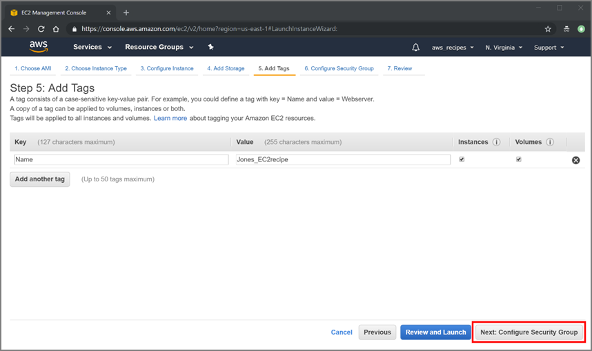

# Create a  Basic Elastic Cloud Compute (EC2) Instance

AWS EC2 Instances are virtual computers that you create to perform processing operations in place of using your desktop or laptop computer, or other on-premises computing hardware. They are customizable based on your computing needs and consist of your choice of operating system, type of CPU, amount of memory, storage, and the security settings that determine how your instance can be accessed.  

This section demonstrates how to create and configure a basic Linux EC2 instance using an AWS **Free Tier** option. AWS Free Tier provides new users an opportunity to gain experience using AWS products and services at no charge. For example, they offer 750 hours of Linux and Windows t2.micro EC2 instances each month for one year. [Read more](https://aws.amazon.com/free/) about this and other Free Tier computing services.  

Once your Linux EC2 instance is created and launched, you can connect to it via the Secure Shell (SSH) protocol. Files can be transferred between your computer and your instance using the Secure copy (SCP) protocol from the Mac and Windows command line interface or the Windows graphical interface for the Secure Copy (WinSCP) protocol. Instructions for connecting to your instance are provided in separate tutorials:  

-   [Connect to EC2 with SSH Mac OS X](04-Connect_to_AWS_EC2_Instance-Windows.md)  
-   [Connect to your EC2 instance using PuTTY](05-Connect_to_AWS_EC2_Instance-MacOS.md)  

> **IMPORTANT**: Once you have completed your processing, the EC2 instance must be stopped or terminated to prevent additional, unexpected charges.  

## Creating a basic EC2 Instance

1.  [Sign in](https://signin.aws.amazon.com/signin?redirect_uri=https%3A%2F%2Fconsole.aws.amazon.com%2Fconsole%2Fhome%3Fnc2%3Dh_ct%26src%3Dheader-signin%26state%3DhashArgs%2523%26isauthcode%3Dtrue&client_id=arn%3Aaws%3Aiam%3A%3A015428540659%3Auser%2Fhomepage&forceMobileApp=0) to you AWS account.  
The AWS Management Console (Figure 3.1) will open after you sign in.  
      
    **Figure 3.1.** AWS Management Console  

2.  Select a region from the dropdown menu next to your account name in the upper right (Figure 3.2). In this tutorial US East (N. Virginia) is used.  
      
    **Figure 3.2.** Select an AWS region dropdown  
    > **NOTE**: There are many factors that should be considered when selecting a region. Read more about the factors that influence the cost of processing based on the region you select [HERE](https://www.concurrencylabs.com/blog/choose-your-aws-region-wisely/).  

3.  Click on **EC2** under **Compute** (Figure 3.3) or search for "EC2" in the search box.  
      
    **Figure 3.3.** Select EC2 under Compute services.  

4.  Click on the **Launch Instance** button in the EC2 Dashboard (Figure 3.4).  
      
    **Figure 3.4.** Launch EC2 instance.  

5.  Find the *Ubuntu Server 18.04 LTS (HVM), SSD Volume Type* \[64-bit (x86)\] Amazon Machine Image (AMI) and click **Select** (Figure 3.5).  
      
    **Figure 3.5.** Select *Ubuntu Server 18.04 LTS (HVM), SSD Volume Type* AMI.  

6.  Click the box next to the *t2.micro* (Free tier eligible) instance type if it is not preselected (Figure 3.6).  
      
    **Figure 3.6.** Select *t2.micro* instance type.  
    This is a small instance type and suitable to the needs of this tutorial. The type of instance you select should be configured to your particular computing needs. AWS has a wide selection of preconfigured instance types. A description of these can be found [HERE](https://aws.amazon.com/ec2/instance-types/).  

7.  Click on **Next: Configure Instance Details** on the lower right in Figure 3.7.  
      
    **Figure 3.7.** Click Next: Configure Instance Details.  
    Since we are only configuring one instance, the defaults on this page do not need to be changed.  

8.  Click on **Next: Add Storage** on the bottom right. 
The AWS General Purpose SSD (gp2) storage offers a good balance of price and performance for running a wide variety of applications. The amount of storage you set will depend on the needs of the application you run.  
The type of storage selected for this tutorial is called an EC2 instance store volume, which is disk storage attached to the host computer. **This is temporary storage and data that are stored on it are lost when the instance is stopped or terminated, or if there is a hardware failure**.  
For this tutorial, leave the default 8 GB unchanged. [Read more](https://docs.aws.amazon.com/AWSEC2/latest/UserGuide/Storage.html) about the different storage options available from AWS.  

9.  Click on **Next: Add Tags** on the bottom left of the *Add Tags* page (Figure 3.8).  
      
    **Figure 3.8.** Click Next: Add Tags.  
    A tag is a label that identifies an AWS resource, and consists of a Key and a Value. Tags can be used to organize, search for, and filter multiple resources.
You will then see the screen in Figure 3.9.  
      
    **Figure 3.9.** Add Tags screen.  

10. Type a name under *Key*(A) and something that identifies the resource, perhaps your last name and a short descriptor, under *Value*(B). For example, Jones_EC2recipe (Figure 3.10).  
      
    **Figure 3.10.** Add names to the tag's *Key* and *Value*.  

11. Click on **Next: Configure Security Group** (Figure 3.11).  
      
    **Figure 3.11.** Click Next: Configure Security Group.  
    A Security Group determines how your instance can be accessed. For this tutorial, you want to limit access only to the computer from which you are working.  

12. Select *Create a new security group* (Figure 3.12).  
      
    **Figure 3.12.** Create a new Security Group.  

13. Type a name next to Security group name to identify the new security group. For example, name it Jones_EC2recipe_securityGroup.  
      
    **Figure 3.13.** Confure new security group

14. Select *My IP* from the dropdown menu under *Source* (Figure 3.13).  
The public IP address of the computer from which you are working will automatically be listed. This means that only the computer that has this IP address can connect to the instance.  
    > **NOTE**: This is a very basic Linux instance security configuration. More complicated security group rules can be configured, for example, allowing access by a range of IP addresses. More information on security group settings can be viewed [HERE](https://docs.aws.amazon.com/AWSEC2/latest/UserGuide/ec2-security-groups.html).  

15. Leave the other settings with their default values. Click **Review and Launch** on the bottom right of the screen (Figure 3.13).  

16. Review the page that displays (Figure 3.14). This page displays your instance configuration details. Ensure all configurations are as you want before you launch the instance. Click on the **Launch** button on the lower right of the screen to deploy your instance.  
      
    **Figure 3.14.** Review instance configuration details before launching.  

17. A pop-up window will appear as shown in Figure 3.15a. This window allows you to create a key pair – “public” and “private” keys – that will be used for securely connecting to your instance from your computer. The public key will be a part of your EC2 instance configuration, and the private key will be kept on your local PC or Mac.  

18. Select *Create a new key pair* from the drop-down menu. Add a name into the *Key pair name* box to name the new key pair; for example, "Jones_EC2recipe" (Figure 3.15a).  
      
      
    **Figure 3.15.** Select an existing key pair or create new key pair.  

19. Click on the **Download Key Pair** button (Figure 3.15b). The private key file (.pem) will download to your default downloads folder. You can move the file to any folder.  

20. Check the box in front of *I acknowledge that I have access to the selected private key file…* after the private key file has been downloaded. Click **Launch Instances** (Figure 3.16).  
      
    **Figure 3.16.** Launch instances.  
    > **NOTE**: The acknowledgement statement may or may not be displayed depending on what kind of account you are.  

21. A *Launch Status* window will open displaying a notice that *Your instances are now launching* (Figure 3.17). Click on the **Instance ID** inside the green box (Figure 3.17) to open the EC2 Dashboard and view details of your running instance (Figure 3.18).  
      
    **Figure 3.17.** Launch status.  
      
    **Figure 3.18.** EC2 dashboard with instance details.  

## Stopping or Terminating an EC2 Instance

After you are finished with your EC2 instance, make sure to **Stop** or **Terminate** it. If you do not do this, **you will continue to incur charges on your account!**  

1.  Type EC2 in the *Find services* search box in the *AWS Management Console* and click **Enter**. You can also click on **EC2** under *Recently visited services*.  

2.  Click on **Running Instances** under *Resources* in the EC2 Dashboard (Figure 3.19) to open the Instances status console.  
      
    **Figure 3.19.** EC2 Resources dashboard.  

3.  Click on the **checkbox** in front of the Instance ID to (Figure 3.20) to select your instance.  

4.  Select the *Action* dropdown menu, and open the *Instance State* dropdown menu.  

5.  Select **Stop** if you want to restart your instance later or **Terminate** if you want to remove the instance and its data (Figure 3.20).  
      
    **Figure 3.20.** Stop or terminate instance.  
