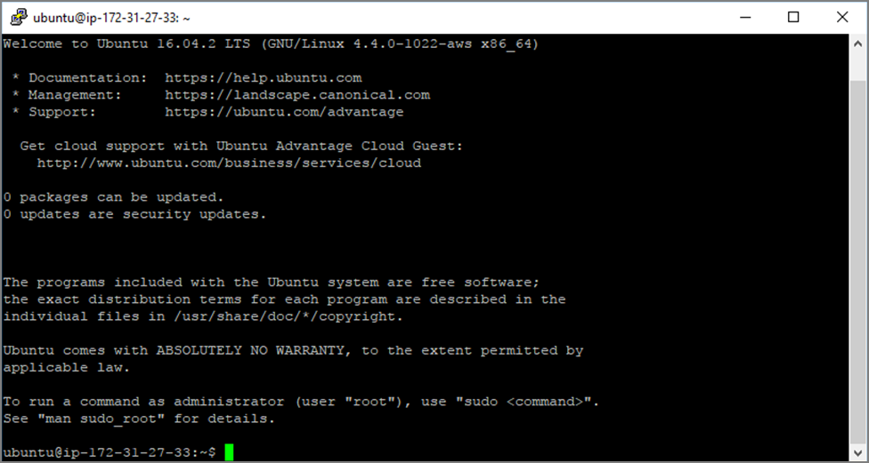
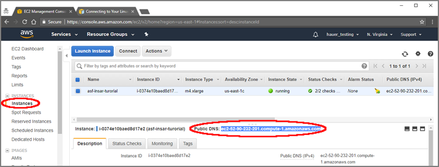

# Connect to AWS EC2 Instance from Windows OS Using PuTTY

After you have created and launched an AWS Linux EC2 instance, you can connect to it from your computer using the [Secure Shell (SSH) protocol](https://www.ssh.com/ssh/). [PuTTY](https://www.ssh.com/ssh/putty/) is a free SSH client that allows you to connect to your EC2 instances from a local computer running Windows. Once you are connected, you work within the EC2 instance just like you would on a local computer running Linux.  

To follow this tutorial, you will first need to create and launch a Linux EC2 instance to which you will connect. Instructions for this are found in the tutorial titled, [Create a Basic Elastic Cloud Compute (EC2) Instance](03-Create_a_Basic_Elastic_Cloud_Compute_Instance.md).

You must have an AWS account. If you have one, click [HERE](https://signin.aws.amazon.com/signin?redirect_uri=https%3A%2F%2Fconsole.aws.amazon.com%2Fconsole%2Fhome%3Fnc2%3Dh_ct%26src%3Dheader-signin%26state%3DhashArgs%2523%26isauthcode%3Dtrue&client_id=arn%3Aaws%3Aiam%3A%3A015428540659%3Auser%2Fhomepage&forceMobileApp=0) to sign into it.  

## Generate a PuTTY Private Key (.ppk) file

1.  Download and install the latest release of [PuTTY](https://www.chiark.greenend.org.uk/~sgtatham/putty/latest.html)  
2.  Open the folder in which PuTTY was installed  
    -   Default path is ```C:/Program Files/PuTTY```.  
3.  Double click the file **puttygen.exe**.   
4.  Click on the **Load** button in PuTTY Key Generator (Figure 4.1) and navigate to the folder that contains the private key file (.pem) created during the EC2 configuration process.  
      
    **Figure 4.1.** Load private key file  
  
5.  Click on the **PuTTY Private Key Files** button in the lower right corner of the window (Figure 4.2) and select All Files (\*.\*).  
      
    **Figure 4.2.** Navigate to saved private keys  
  
6.  Click the box next to your private key file (.pem) to select it (Figure 4.3).  
      
    **Figure 4.3.** Select private key  
  
7.  Click **Open**.  
8.  Click **OK** to close the PuTTYgen Notice pop-up window (Figure 4.4).  
      
    **Figure 4.4.** Confirm import of key  
  
9.  In PuTTY Key Generator, make sure Type of key to generate value is set to *RSA* (Figure 4.5).  
      
    **Figure 4.5.** Generate RSA key and Save  
  
10. Click **Save private key**.  
11. Click **Yes** to close the PuTTYgen Warning pop-up window.  
12. Navigate to the location you want to store your PuTTY Private Key file (.ppk) (Figure 4.6).  
      
    **Figure 4.6.** Save PuTTY Private Key File to a directory  
  
13. Give the file a name.  
14. Click **Save**.  
15. Close the PuTTY Key Generator Window.  
  
Once you have generated a private key, you can use it whenever you need to connect to a new EC2 instance.  
  
## Connect to the EC2 instances  
  
1.  Click on the desktop icon or the **putty.exe** file in the PuTTY folder to open PuTTY.  
2.  Find the *Public DNS* for your instance, which is displayed in AWS in the EC2 Management Console Instance Description in the middle of the screen.
3.  From the PuTTY Configuration window, type "ubuntu@**your_public_DNS**" in the Host Name (or IP address) box (Figure 4.7).  
      
    **Figure 4.7** Configure instance Host Name in PuTTY  
  
3.  Set the Port to 22.  
4.  Set the Connection Type to SSH (Figure 4.7).  
5.  In the *Category* pane under *Connection*, click on the **+** next to *SSH* (Figure 4.8).  
      
    **Figure 4.8** Expand SSH options from PuTTY Configuration window  
  
6.  Click **Browse** under Authentication parameters and navigate to the directory where your PuTTY Private Key (.ppk) file is located and select it.  
7.  Click **Open**. If you want to save these settings to use later, navigate to *Sessions* in the PuTTY Category tree. Enter a name in the *Saved Sessions* box and click **Save** on the right.  
8.  Click **Open** in PuTTY Configuration to connect to your Instance. If this is the first time you have connected to your Instance, a PuTTY Security Alert will ask you whether to proceed with the connection (Figure 4.9).  
      
    **Figure 4.9**  A PuTTY security alert will appear the first time you connect to an instance.  
  
9.  Click **Yes** to complete the connection.  
10. The EC2 instance window will appear (Figure 4.10). To view files and directories in a Linux (Ubuntu) instance, use the ls (list) and cd (change directory) commands.  
      
    **Figure 4.10.** EC2 instance window
  
## Move files into & out of an AWS EC2 Instance – Windows  
  
You can transfer files into and out of a Linux EC2 instance from a local computer running Windows by either of these methods:  
  
1.  **Windows Secure Copy (WinSCP)**: WinSCP provides a graphical interface (GUI) that allows you to drag and drop files between your local computer and your AWS instance. This is similar to using Windows File Explorer.  
2.  **PuTTY Secure Copy**:  PuTTY Secure Copy is run from the Windows Command Prompt.  

Using an EC2 instance to process/analyze data requires that you move the files to be processed to the instance, and then remove the resulting products before the instance is terminated.  

### Find Your EC2 Instance Public DNS  

1.  Open the *AWS Instances* window in the EC2 Management Console (Figure 4.11). The *Public DNS* of your EC2 instance displayed in this window will be used in the next two sections.  
      
    **Figure 4.11.** Locate Public DNS for instance from EC2 Management Console  
  
### Transferring Files Using WinSCP  
1.  Download [WinSCP](https://winscp.net/eng/download.php).  
2.  Click on **Installation package** (Figure 4.12) and then use the default installation options.  
      
    **Figure 4.12.**  
  
3.  Click on the Desktop icon to start WinSCP.  
4.  Click on **New Site** (Figure 4.13).  
      
    **Figure 4.13.**  
  
5.  Enter the *Public DNS* displayed in your EC2 Management Console Instances window into the Host Name box.  
6.  Type *ubuntu* in the *User name* box.  
7.  Select the Advanced dropdown menu and, under Sessions, select *Advanced*.  
8.  Click on **Authentication** under *SSH* (Figure 4.14).  
      
    **Figure 4.14.**  
  
9.  Click on the ... button under *Private key file* and navigate to the folder where your PuTTY Private Key (.ppk) file is located and select it. Instructions for creating a PuTTY Private Key (.ppk) file can be found in the tutorial titled Connect to an AWS EC2 Instance – Windows & PuTTY.  
10. Click the **OK** button to close the *Advanced Site Settings* window. If you want to save your settings to use again later, click on the **Save** button in the WinSCP Login window (Figure 4.15). A pop-up window will appear where you can name the settings.  
      
    **Figure 4.15.**  
  
11. Click the **Login** button.  
12. The first time you connect to your instance, you will be asked about connecting to an unknown server. Click the **Yes** button to continue (Figure 4.16).  
      
    **Figure 4.16.**  
  
    > **NOTE:** If you stop your EC2 instance and restart it, a new Public DNS will be assigned. You will need to copy and paste this into the WinSCP Host name box before you can connect.  

    After you have connected, the left pane of the window will display the file contents of your computer and the right pane displays the contents of your EC2 instance (Figure 4.17).  
      
    **Figure 4.17.**  
  
13. Drag and drop files from your computer into your EC2 instance to process. When processing is complete, drag and drop the products from EC2 to your computer.  
    > **IMPORTANT:** Files must be transferred from your EC2 instance to your computer before you terminate the instance! All files will be deleted when the instance is terminated.  

### Transferring Files Using PuTTY Secure Copy (PSCP)  

#### Windows 10  

1.  Click on the **Start** button  on the Taskbar (Figure 4.18).  
    
  **Figure 4.18.**  Find and open command prompt in Window 10
  
2.  Scroll down the list of Apps to the Windows System folder.  
3.  Select **Command Prompt**.  
    > **NOTE:** You can also click the **Start button** and type *cmd*; then select **Command Prompt** from the search results. In either case, the *Command Prompt* window will open (Figure 4.19).  
  
      
    **Figure 4.19.** Command prompt window  
  
#### Windows 7  

1.  Click on the **Start** button  on the Taskbar.  
2.  Type *cmd* in the Search programs and files box (Figure 4.20).  
      
    **Figure 4.20.** Find and open command prompt in Window 7  
  
3.  Select *Command Prompt* from the search results. The Command Prompt window will open as in Figure 4.19 above. When using PSCP to transfer files between your computer and your EC2 instance, your PuTTY Private Key (.ppk) file must be in the folder you are working in, or you must provide a path in the PSCP command to the folder in which the file is located. 
    > **EXAMPLE:** If AWSkey.ppk file is stored in a folder named **keys**, include the path ```C:\Users\username\keys\AWSkey.ppk``` in the PSCP command.  
  
### Move a file into your EC2 instance
  
1.  At the Windows command prompt, type (notice where spaces are placed):  
    ```  
    C:\> pscp -i yourkey.ppk yourfilename ubuntu@public_DNS:/home/ubuntu/
    ```  
  
2.  Move your awskey.ppk file to your Downloads folder using Windows File Explorer or provide a path to the folder in which your .ppk file is located.  
3.  Navigate to your Downloads folder using the [change directory](https://www.digitalcitizen.life/command-prompt-how-use-basic-commands) (cd) command at the Windows command prompt and press **Enter**.  
    ```  
    C:\Users\username > cd downloads
    ```  
  
4.  Type the PSCP command, which includes your .ppk filename (and path if necessary), the name of the file you want to transfer, the Public DNS of your EC2 instance, and the path to a folder in your instance: (Figure 4.21)  
    ```  
    C:\> pscp -i awskey.ppk S1A_EW_GRD.zip ubuntu@ec2-52-89-147-172.us-east-2.compute.amazonaws.com:/home/ubuntu/
    ```  
  
      
    **Figure 4.21.**  
  
    ```  
    C:\> pscp -i C:\<path>\yourkey.ppk C:\<path>\yourfilename ubuntu@public_DNS:/home/ubuntu
    ```  
    > **Command syntax:**  brackets <> indicate optional paths to your .ppk file and the file you want to move if they are not in the folder you are in.  
  
### Move a file out of your EC2 instance
  
1.  At the Windows command prompt, type:  
    ```  
    C:\> pscp -i yourkey.ppk ubuntu@publicDNS:/home/ubuntu/yourfilename C:\[local_destination_path]\[folder]  
    ```  
    
    > **EXAMPLE:**  Move a product generated from an application out of your EC2 instance PRODUCT directory to the Data folder on your Windows computer.  
2.  Use Windows File Explorer to move a copy of my awskey.ppk file to your Data folder or provide a path to the folder in which your .ppk file is located  
    > **NOTE:** If you don’t include a local destination path and folder in the command, the file will download into the folder the command is run from. In this case, the command syntax would be: ```C:\> pscp -i C:\[path]\yourkey.ppk ubuntu@publicDNS:/home/ubuntu/[folder]/filename```  
3.  At the Windows command prompt, navigate to your Data folder using the [change directory](https://www.digitalcitizen.life/command-prompt-how-use-basic-commands) (```cd```) command:
    ```  
    C:\> cd data  
    ```  
    And press **Enter**.  
4.  At the command prompt, type the PSCP command, which includes your .ppk filename, the Public DNS of your EC2 instance, and the name of the file you want to transfer.  
    ```  
    C:\> pscp -i awskey.ppk ubuntu@ec2-52-89-147-172.us-east-2.compute.amazonaws.com:/home/ubuntu/PRODUCT/F2_unw_phase.tif C:\data_files  
    ```  
    ```  
    C:\> pscp -i C:\[path]\yourkey.ppk ubuntu@public_DNS:/home/ubuntu/[path]/yourfilename C:\[local_destination_path]  
    ```  
    > **IMPORTANT:** Files must be transferred from your EC2 instance to your computer before you terminate the instance, or they will be deleted!
