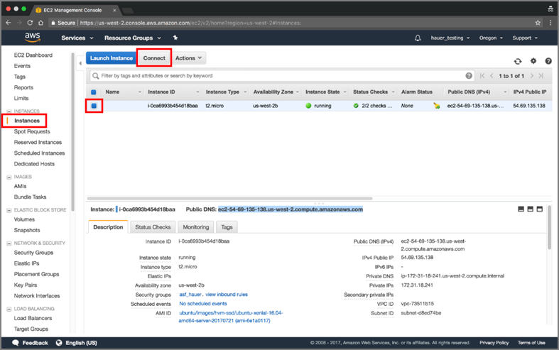

# Connect to AWS EC2 Instance - Mac OS X

When you have created and launched an AWS Linux EC2 instance, you need to be able to connect to it from your computer using the SSH protocol. This will use the Mac Terminal window command line. You must have an AWS account. If you have one, click [HERE](https://signin.aws.amazon.com/signin?redirect_uri=https%3A%2F%2Fconsole.aws.amazon.com%2Fconsole%2Fhome%3Fnc2%3Dh_ct%26src%3Dheader-signin%26state%3DhashArgs%2523%26isauthcode%3Dtrue&client_id=arn%3Aaws%3Aiam%3A%3A015428540659%3Auser%2Fhomepage&forceMobileApp=0) to sign into it.  

You will need to create and launch a Linux EC2 instance to connect to. Instructions for this are found in the [*Create a Basic Elastic Cloud Compute (EC2) Instance*](03-Create_a_Basic_Elastic_Cloud_Compute_Instance.md) tutorial.  

## Connect to an EC2 instance using SSH

1.  In the AWS EC2 Management Console (Figure 5.1), click on **Instances** in the left menu under *EC2 Dashboard*.  
    
      
    **Figure 5.1.** EC2 instance from EC2 instances Dashboard  
    
2.  Select an instance by clicking on the box next to the name. Click on the **Connect** button to open the *Connect To Your Instance* window (Figure 5.2).  

      
    **Figure 5.1.** Connect to EC2 instance and get EC2 instance information.  
    
    > **NOTE:** You will copy and paste the information from this window to you Mac Terminal window later in the tutorial.  
3.  Open a terminal window on your Mac. Use the *cd* (change directory) command to navigate to the folder containing the *private key file* (.pem) created during the EC2 configuration process. This is usually the *Downloads* folder, unless you moved the file to another folder.  

    ```
    $ cd ~/<path to folder with .pem file>
    ```  
    > **EXAMPLE**: ```$ cd ~/Downloads```  
    
    To view the contents of a directory:  
    
    ```
    $ ls -ltr
    ```  
4.  Change access permissions for the *private key file* (.pem)  
    ```
    $ chmod 400 <filename.pem>
    ```
    
    Or copy the command (first circled item) from the *Connect To Your Instance* window (Figure 5.3) and paste at the Terminal prompt.  
    
      
    **Figure 5.3.** Information for connecting to EC2 instance for SSH client.  
    
5.  Press **Enter**  
6.  From the “Connect To Your Instance” window, copy the complete SSH command under *Example:* (second circled item in Figure 5.3).  
    
    This string includes your filename.pem, the username ubuntu, and the Public DNS of your EC2 instance.  
7.  Paste the string at the Terminal prompt.  
8.  Delete the double-quotes enclosing filename.pem and press **Enter**.  
9.  Type *yes* when prompted ```Are you sure you want to continue connecting?``` and press **Enter**.  
    
    A terminal window will appear for your EC2 instance (Figure 5.4).  
    
      
    **Figure 5.4.** Terminal window after successful connection to EC2 instance.  
    
You are now connected to your EC2 instance!  

## Move a file **into** an EC2 instance

To move a file (for example, a file to be processed) from your computer to your EC2 instance Home directory of user **ubuntu** using Secure Copy Protocol (SCP), type the commands below in the terminal window of your Mac. Words surrounded by ```<>``` indicate optional input.  

Type:
1. ``` $ scp -i private.pem your_filename ubuntu@EC2instance_public_DNS:/home/ubuntu/```  
2. ``` $ scp -i AWSrecipe.pem S1A_EW_GRDM.zip ubuntu@ec2_52_89-147-172.us-east-2.compute.amazonaws.com:/home/ubuntu```  
3. ``` $ scp -i pemfile.pem your_filename ubuntu@Public_DNS:/<path>/```  

## Move a file **out of** an EC2 instance

To move a file (for example a processing product) from your EC2 instance ubuntu directory to your computer using SCP, type the commands below in your Mac terminal.  

To move file *S1A_EW_GRDM.zip* from your computer to your EC2 instance, follow the steps below.  Words surrounded by ```<>``` indicate optional input.  

Type:
1. ``` $ scp -i private.pem ubuntu@Public_DNS:/home/ubuntu/filename ~/local_folder```  
2. ``` $ scp -i asf_aws.pem ubuntu@ec2_52_89-147-172.us-east-2.compute.amazonaws.com:/home/ubuntu/PRODUCT/F2_unw_phase.tif ~/Downloads```  
3. ``` $ scp -i pemfile.pem ubuntu@Public_DNS:/<path>/your_filename ~/<path>/local_directory```  

If you store your .pem file in a directory other than the directory you are working in, you must provide a path to that directory in the SSH command.  

> **EXAMPLE**: ``` $ ssh -i ~/Documents/aws_pem/asf_hauer.pem ubuntu@ec2-54-69-135-138.us-west-2.compute.amazonaws.com```  

> **NOTE**: If you *Stop* your instance using the EC2 Management Console (Action > Instance State > Stop) (Figure 5.5), when you restart it you will be assigned a new Public DNS. Use this new DNS to reconnect  

    
  **Figure 5.5.** Stopping an EC2 Instance.  
