# Create Cloud Storage Using AWS Simple Storage Service Buckets

Amazon Web Services (AWS) Simple Storage Service (S3) is [object-based storage](https://searchstorage.techtarget.com/definition/object-storage), where data (objects) are stored in S3 buckets. The AWS S3 Standard storage class provides safe, scalable, fast, and inexpensive storage and retrieval of any amount of data. The Standard class is designed for data that are accessed frequently. Other storage class options are available for different data storage requirements. [Read more](https://aws.amazon.com/s3/storage-classes/?nc=sn&loc=3) about the different types of storage available and their uses.  

S3 has a basic monthly cost for storing data and this varies by [AWS region](https://docs.aws.amazon.com/AWSEC2/latest/UserGuide/using-regions-availability-zones.html). Transfer charges are applied for data moved out of an S3 bucket to the Internet, as well as data transferred between AWS regions, though intraregional transfer charges are much less. There are no charges for data uploaded to a bucket or transferred between S3 buckets (or any AWS services) in the same region.  

This tutorial demonstrates the basic concepts of S3 buckets using the Amazon S3 console.  

> IMPORTANT: There are no charges for creating an S3 bucket,but there are costs for storing data (objects) and transfering data into and out of a bucket.  

You must have an AWS account before you start this tutorial. Click [HERE](https://signin.aws.amazon.com/signin?redirect_uri=https%3A%2F%2Fconsole.aws.amazon.com%2Fconsole%2Fhome%3Fnc2%3Dh_ct%26src%3Dheader-signin%26state%3DhashArgs%2523%26isauthcode%3Dtrue&client_id=arn%3Aaws%3Aiam%3A%3A015428540659%3Auser%2Fhomepage&forceMobileApp=0) to sign in or create a new AWS account.  

## Create an S3 Buckets

1.  Sign in to your AWS account. The *AWS Management Console* will open (Figure 6.1).  

    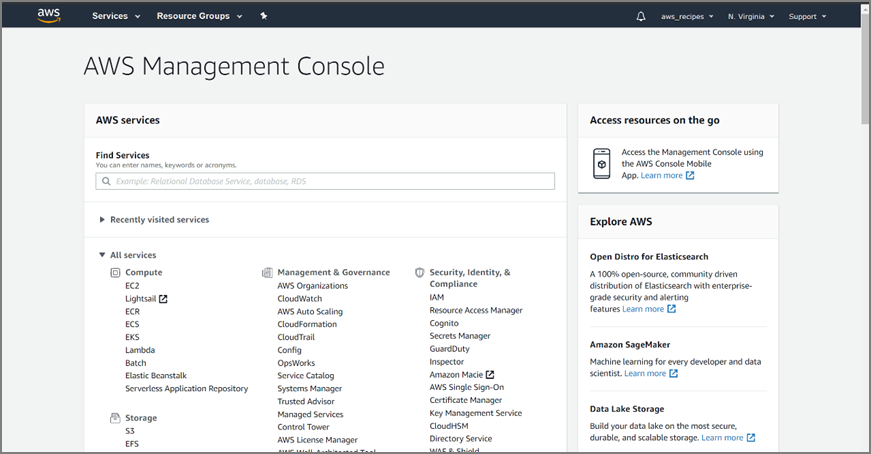  
    **Figure 6.1.**  
    
    > NOTE: Clicking on the  logo in the upper left corner will open the *Management Console* from any AWS window.  

2.  Type S3 in the search box under *Find Services*, and click on *S3 Scalable Storage in the Cloud* (Figure 6.2).  

    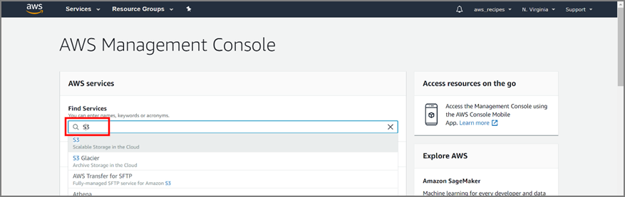  
    **Figure 6.2.**  
    
3.  Click **Create bucket** in the S3 console (Figure 6.3).  

    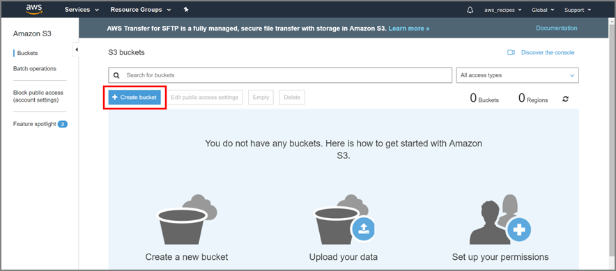  
    **Figure 6.3.**  
    
4.  Enter a *Bucket name* in the *Create bucket* pop-up window (Figure 6.4).  

    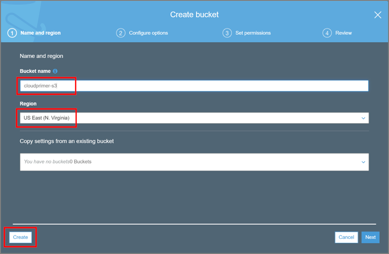  
    **Figure 6.4.**  
    
5.  For this tutorial select **US East (N. Virginia)** as the *Region*  

    > IMPORTANT: There are extra costs associated with data that are transferred between AWS services across regions, but there are no costs for data that are transferred between AWS services within the same region. Thus, if you do not want to incur data transfer costs, make sure the S3 bucket used to store data is in the same region as the EC2 instance being used to process the data.  

6.  Click **Create**.  

Your new bucket is now displayed in the *S3 buckets console* (Figure 6.5).  

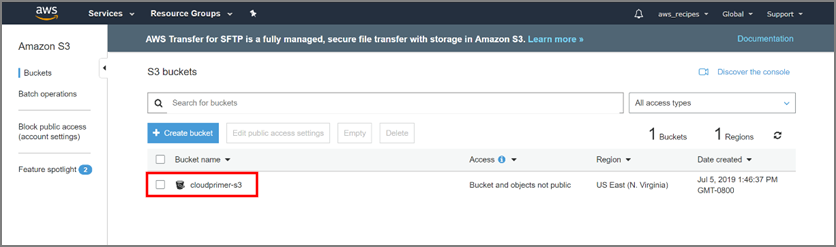  
**Figure 6.5.**  

## Add a File to a Buckets

1.  Click on the bucket name in the *S3 buckets console* (Figure 6.5) to open the bucket (Figure 6.6).  

    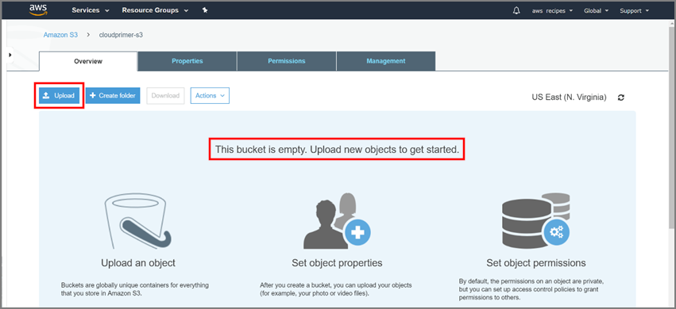  
    **Figure 6.6.**  
    
    The bucket contents window shows that the bucket is empty.  

2.  Click **Upload** (Figure 6.6).  

    You will then see an Upload pop-up window (Figure 6.7). In this window, you have the option to drag and drop files into the bucket, or to click on **Add files** and navigate to the location of the files on your computer.  

    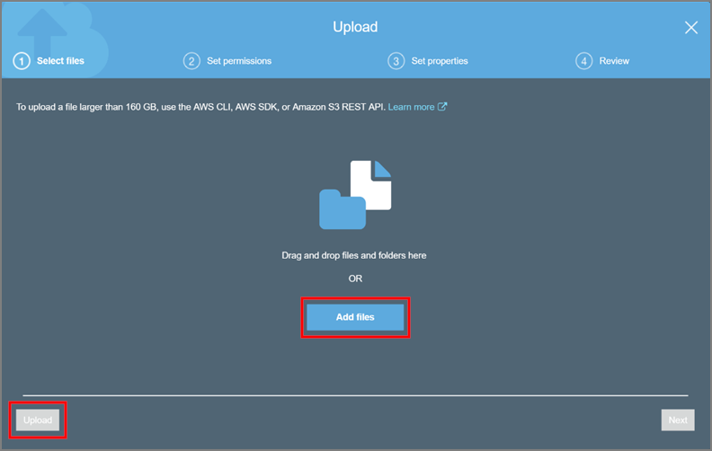  
    **Figure 6.7.**  
    
3.  Click **Upload** after selecting the files to add to your bucket (Figure 6.8).  

    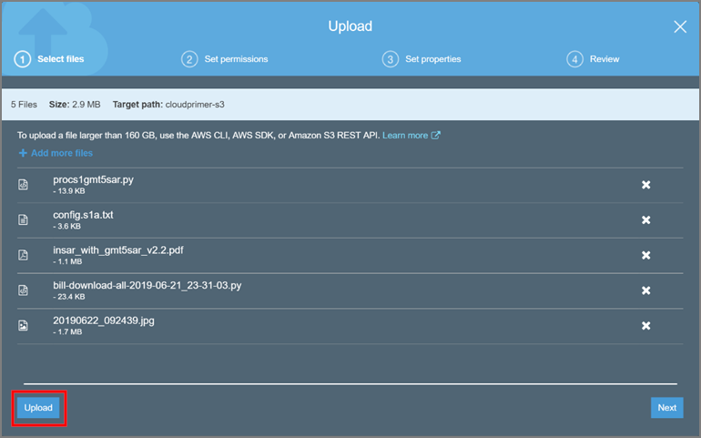  
    **Figure 6.8.**  
    
    When the upload is complete, the files will appear in your bucket (Figure 6.9).  

    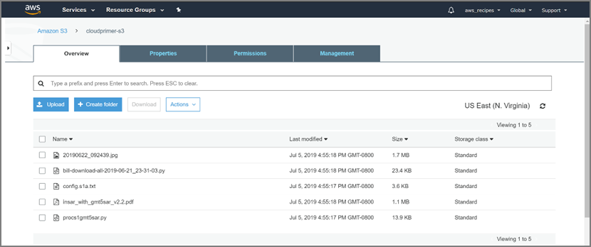  
    **Figure 6.9.**  
    
4.  Select the check box next to a filename to view information on the file (Figure 6.10). The information appears on the right side of the window.  

    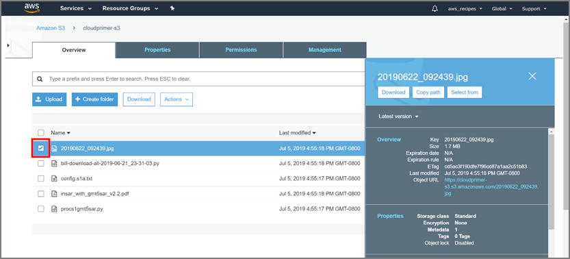  
    **Figure 6.10.**  
    
## Download a File from a Buckets

1.  Open a bucket to display the contents.  

2.  Check the box in front of a file to open the file information window (Figure 6.10)  

3.  Click Download (Figure 6.11)  

      
    **Figure 6.11.**  
    
## Working with Files in a Buckets

Files can be organized in a bucket by creating a folder and copying files into the folder.  

1.  Click **Create folder**. Give the folder a name, then click **Save** (Figure 6.12).  

    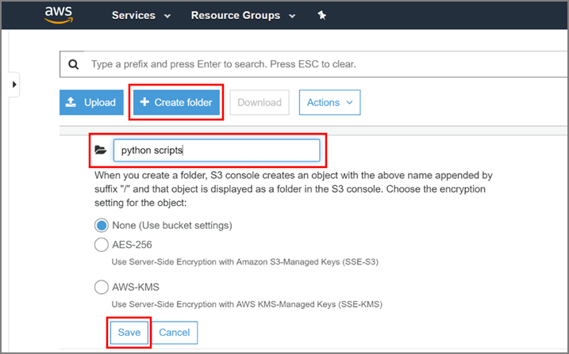  
    **Figure 6.12.**  
    
2.  Check the box in front of the file(s) you want to move to the new folder (Figure 6.13).  

    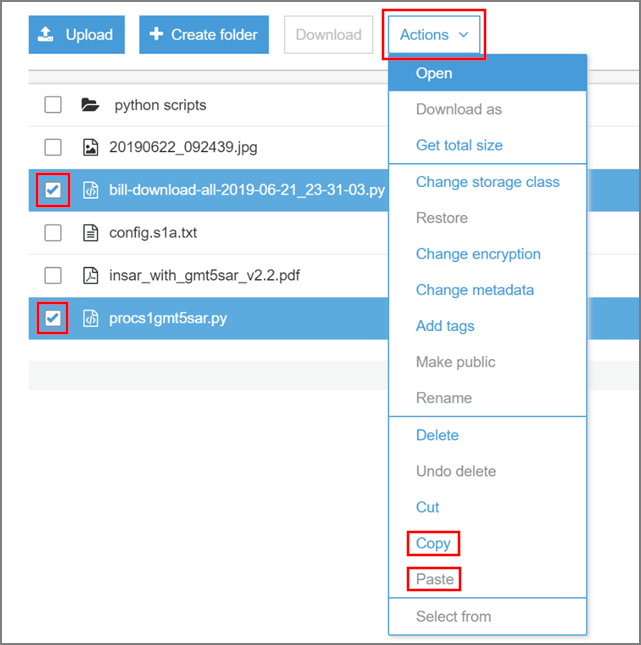  
    **Figure 6.13.**  
    
3.  Click on **Actions** to open the dropdown menu, then select **Copy**.  

4.  Click on the *folder name* to open the folder.  

5.  Click on **Actions** again and select **Paste**.  

6.  Use the browser back arrow to return to the main level of the bucket (or use the breadcrumbs at the top of the bucket window to move one level up).  

7.  Select the file(s) you moved. Click on *Actions*, then select *Delete*.  

8.  Confirm that you want to delete the files in the *Delete objects* pop-up window. Click **Delete** (Figure 6.14).  

    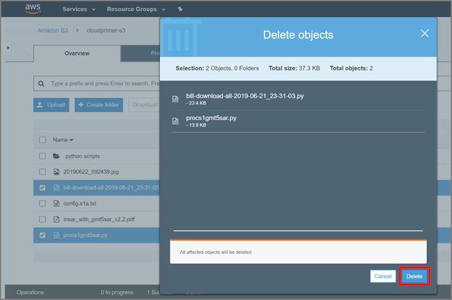  
    **Figure 6.14.**  
    
## Delete a Buckets

Deleting a bucket deletes the bucket as well as its contents. If you want to keep the bucket for future use and preserve the name, you can delete the content files individually (see previous section). Or you can empty the bucket, which deletes the contents without deleting the bucket.  

### Empty a bucket

1.  Check the box in front of the bucket name in the S3 buckets list and click on the **Empty** button (Figure 6.15).  

    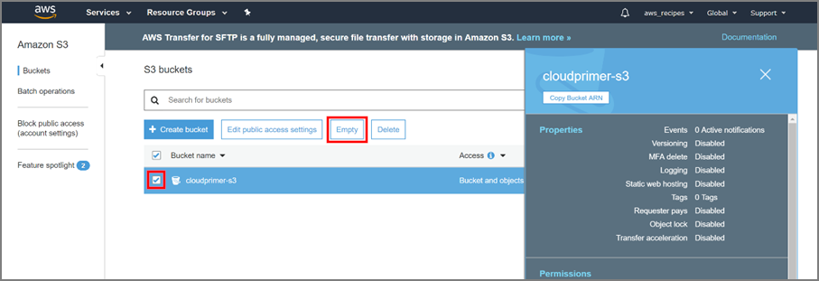  
    **Figure 6.15.**  
    
2.  Type or copy and paste the bucket name in the Empty bucket pop-up window, then click on **Confirm** (Figure 6.16).  

    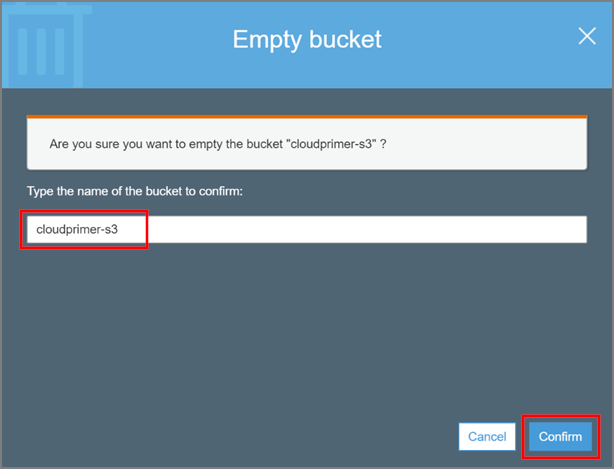  
    **Figure 6.16.**  
    
### Delete bucket

1.  Check the box in front of the bucket name in the *S3 buckets* list, and click **Delete** (Figure 6.17).  

    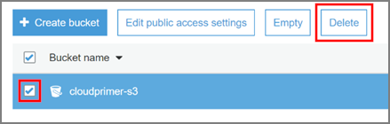  
    **Figure 6.17.**  
    
2.  Type or copy and paste the bucket name in the *Delete bucket* pop-up window, then click **Confirm** (Figure 6.18).  

    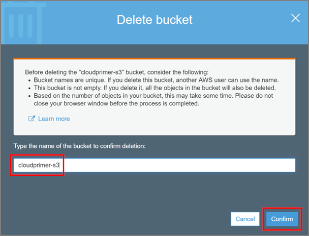  
    **Figure 6.18.**  
