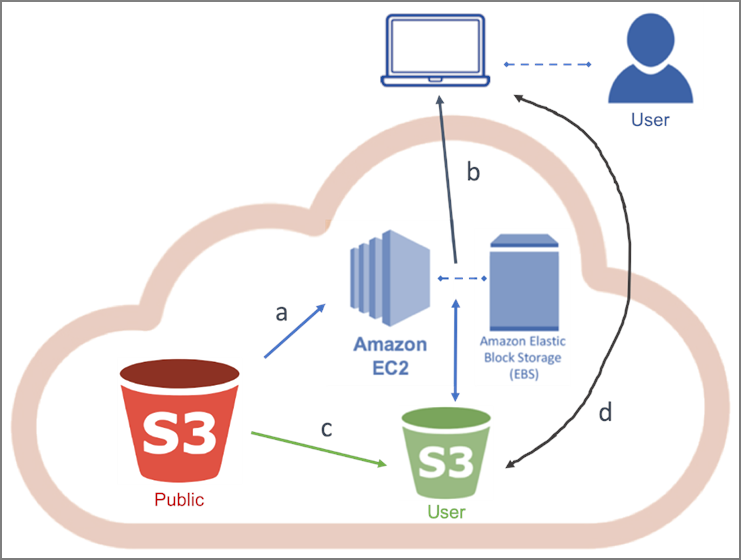

# Access AWS-hosted S3 Earth Data

In this tutorial, we show how to access AWS-hosted Earth Observing data (such as Landsat-8) that is stored in a public AWS S3 bucket, from your AWS EC2 instance using the AWS command line interface, and copying some data files to your AWS instance or S3 storage for further use.  

AWS instance storage or [Elastic Block Storage (EBS)](https://aws.amazon.com/ebs/?ebs-whats-new.sort-by=item.additionalFields.postDateTime&ebs-whats-new.sort-order=desc) allows you to create storage volumes and attach them to Amazon EC2 Instances. Once attached, you can create a file system on top of these volumes, run a database, or use them in any other way you would use block storage. For [pricing of EBS](https://aws.amazon.com/ebs/pricing/), see Amazon resources.  

> NOTE: this type of storage goes away (data is deleted) as soon as the instance is terminated (stopped).  

Suggested Use: for short-term storage needs, such as when running an analysis and need temporary storage for analysis output.  

[AWS Simple Storage Service (S3)](https://aws.amazon.com/s3/) is object-based storage designed to store any type of data and access it over the Internet. Data (objects) are stored in S3 buckets. The AWS S3 Standard storage class provides safe, scalable, fast, and inexpensive storage and retrieval of any amount of data. The Standard class is designed for data that are accessed frequently. Other storage class options are available for different data storage requirements. S3 has a basic monthly cost for storing data and this varies by AWS region. Transfer charges are applied for data moved out of an S3 bucket to the Internet, as well as data transferred between AWS regions, though intraregional transfer charges are much less. There are no charges for data uploaded to a bucket or transferred between S3 buckets (or any AWS services) in the same region.  

Information on AWS storage types can be found on the [Cloud Storage with AWS](https://aws.amazon.com/products/storage/) webpage.  

## Create an EC2 Instance 

Instructions for setting up an EC2 instance can be found in the [Create a Basic Elastic Cloud Compute (EC2) Instance](03-Create_a_Basic_Elastic_Cloud_Compute_Instance.md) tutorial. In that tutorial, in Figure 3.5, the Ubuntu server was chosen as the Amazon Machine Image (AMI). If you wish to use the AWS-CLI command language, which is recommended for use with S3, consider selecting *Amazon Linux AMI* instead. If you have already set up an AMI using the Ubuntu server you will need to install the AWS-CLI yourself. You can also create another instance by following the steps in Section 3, but in Step 4, select Amazon Linux AMI 2018.03.0 (HVM), SSD Volume Type, then continue wit Step 5.  

## Connect to your instance  

If your local machine is a Windows-based PC, follow the instructions in the tutorial titled, [Connect to an AWS EC2 Instance – Windows & PuTTY](04-Connect_to_AWS_EC2_Instance-Windows.md). When you get to Step 2 of section 4.2, type ```ec2-user@ your_publicDNS``` instead of ```ubuntu@ your_publicDNS```.  

If your local machine is an OS X-based Mac, follow the instructions in the tutorial titled, [Connect to an AWS EC2 Instance – Mac OS X](05-Connect_to_AWS_EC2_Instance-MacOS.md). When you get to Step 3 of section 5.1, type ```ec2-user@ your_publicDNS``` instead of ```ubuntu@ your_publicDNS```.  

## Set up AWS command line interface (AWS CLI)

There are two ways to interact with S3 storage, a **graphical interface console** (i.e., AWS S3 Console), and a **command line** (i.e., AWS-CLI). AWS-CLI is a command line tool that can replicate everything you can do with the graphical console. It can control hundreds of AWS services, but the major use case is using data in an S3 bucket.  

There are cases in which using AWS-CLI is preferred, or in some cases required:  
-   It is much easier to recursively download/upload entire directories with AWS-CLI.  
-   EC2 instances do not have a graphical interface console, so if you need to transfer data between EC2 and S3 storage, you will need to use AWS-CLI.  
-   When working with openly available datasets, you will most likely have to use AWS-CLI. The public repositories on AWS do not belong to you, and therefore you will not be able to see what is in the S3 buckets because the graphical interface console only shows you data in the S3 buckets you own.  

If opting to use AWS-CLI to interact with AWS S3 storage, you will need to set up AWS-CLI first. The AWS-CLI comes pre-installed with the *Amazon Linux AMI* instance type, however you will need to configure the AWS-CLI (step number 6 below) if this is your first time using AWS-CLI in the instance. After you configure the AWS-CLI you can skip ahead to the section titled, *Get openly available data from S3 into EC2 or user S3 bucket*. If you are working from an ubuntu instance, please follow the instructions below to install and configure AWS-CLI.  

1. Check if your EC2 instance has AWS-CLI already installed. After connecting to your instance, type the following in the terminal window:  
```
which awscli
```  
If AWS-CLI is already installed, the response will be its location of the AWS-CLI executable on the system.  
```
/usr/bin/awscli
```  
If AWS-CLI is not installed skip to step 3.

2.  If AWS-CLI is installed type the following to upgrade packages at this time:  
```
sudo apt update
sudo apt upgrade
```  

3.  To install AWS-CLI type the following:  
```
sudo apt awscli
```  
4.  If this is your first usage of the AWS-CLI, you will first need to configure it. To configure the AWS-CLI type the following:
```
aws configure
```  
You will be asked to enter 4 pieces of information in succession:  
    -   AWS Access Key ID \[None\]:  
    -   AWS Secret Access Key \[None\]:  
    -   Default region name \[None\]:  
    -   Default output format \[None\]:  

  *Access Key ID* and *Secret Access Key* are just like your AWS account name and password, but for security reasons they are not the ones you use to log into the console.  
  
  To acquire the *Access Key ID* and *Secret Access Key*, follow the instructions from AWS: <https://docs.aws.amazon.com/cli/latest/userguide/cli-chap-configure.html#cli-quick-configuration>.  
  
  Once you have configured AWS-CLI, you can check S3 contents, copy files from S3 to your instance, and finally, do something with that data!  

  > NOTE: To get help specifically on S3, type ```aws s3 help```  

  > NOTE: To get general help information, type ```aws help```  

## Get publicly available data from S3 into EC2 or user S3 bucket

AWS hosts a range of openly available data on S3 as part of their [Registry of Open Data](https://registry.opendata.aws). As mentioned previously, when working with public datasets, you will most likely have to use AWS-CLI.  

In this example we will access the [Landsat-8 data hosted on AWS Registry of Open Data](https://registry.opendata.aws/landsat-8/). To find other publicly available data stored on AWS S3, please visit [Registry of Open Data on AWS](https://registry.opendata.aws/). The diagram below in Figure 7.1 summarizes the use cases for this workflow.  

  
**Figure 7.1.** Get publicly available data from S3 into EC2 or user S3 bucket workflow diagram.  

1.  List Landsat 8 files available in AWS S3 Landsat bucket by typing:  
```
aws s3 ls s3://landsat-pds/c1/L8/
```  

2.  Create a new folder (directory) in your EC2 instance, e.g. landsat-test, by typing:  
```
mkdir landsat-latest
```  

  > NOTE: This will use the EBS storage associated with the EC2 instance to which you are connected.  
  
  > IMPORTANT: All data is deleted and lost once the instance in terminated. Save the desired files to a safe location (e.g., S3, or local machine) before terminating the instance or the data will be lost. There are costs associated with storing data.  

3.  Change to the folder you just created by typing:  
```
cd landsat-test
```  

4.  Copy one Landsat 8 data file from S3 storage to your EC2 Instance (step a in Figure 7.1) by typing:
```
aws s3 cp s3://landsat-pds/c1/L8/042/034/LC08_L1TP_042034_20170616_20170629_01_T1/<landsat_file_name> landsat_test
```  
The *landsat_test* at the end of the command is the directory location defining where to copy the file to.  

5.  Use the *recursive* option to copy all files from one Landsat 8 file directory to your directory by typing:  
```
aws s3 cp s3://landsat-pds/directory_name/ ./ --recursive
```  
  To download files from your EC2 instance to your on-premises hardware, personal laptop or computer (step b in Figure 7.1), follow the steps in Moving files into & out of an AWS EC2 Instance – Windows tutorial  

  If you would like to keep data beyond the termination of your current EC2 instance for use in future workflows, you can stop the instance or,  if you need more storage than the EC2/EBS space allows, you can create an S3 bucket of your own.  
  
  > IMPORTANT: There is no cost associated with creating an S3 bucket; however, you will incur costs for storage of the data and transferring data to and from the bucket. For more information on Storage or Cost, please see [Cloud Storage with AWS](https://aws.amazon.com/products/storage/). 
